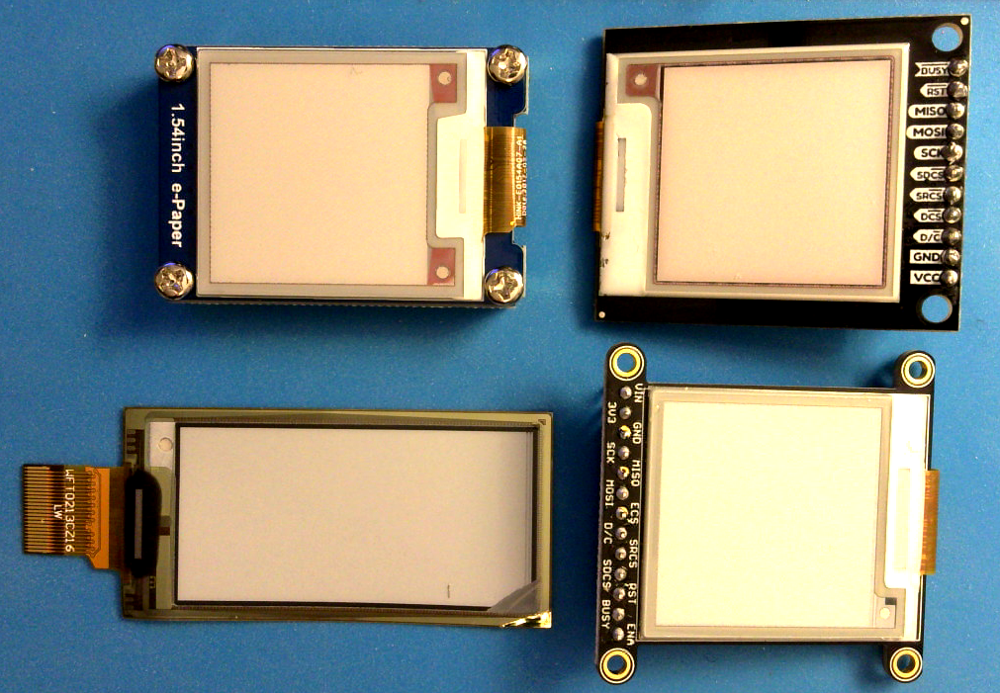

# ePaper Displays
There are lots of ePaper displays on the market now. These notes are not comprehensive, but they cover a few available boards and support parts.

You can find the [code examples at this link](https://github.com/tigoe/display-examples/tree/main/EPaper_Examples).

The refresh rate on ePaper displays is very slow, on the order of several seconds per frame. However, the advantage to them is that they retain their image when powered down. They have a crisp image, in either black and white, or black, white and one other color. They're ideal for applications where the text or image changes infrequently, but needs to be updated dynamically. 

## Hardware
eInk displays are sold either as the bare display or as a breakout board. Figure 1 shows four different boards; the bottom left is a bare display and the others are breakout boards. The breakout boards will connect easily to a solderless breadboard, but the bare displays have only a flexible ribbon connector, typically  designed for a [24 Position, 0.5mm pitch ZIF connector](https://www.crystalfontz.com/product/cs050z24ga0-24-position-zif-connector).

See the [Inventory page](../inventory.md#epaper-displays) for the various models I've tested. 

*Figure 1. Four ePaper displays. Clockwise from top left: WaveShare 1.54" breakout board; Sparkfun SparkX 1.54" tri-color breakout board; Adafruit 1.54" monochrome breakout board; Adafruit 2.13" tri-color bare display. The breakout boards all have connectors that fit nicely into breadboards.*

### Pin Connections
eInk displays have an SPI interface with a few additional pins. Some breakout boards such as the WaveShare do not send data to the microcontroller, so they do not have a serial data out (SDO) pin. In addition to the usual SPI data in (SDI), data out (SDO), clock (SCK), and chip select (CS), these displays also have a BUSY pin, a Data/Command (DC) and a RESET pin. 

Adafruit and Sparkfun add SRAM frame buffers and SD cards to their breakout boards so you can transfer a frame from an SD image or video to the buffer, and then to the screen. These additional features share the SPI bus, but add two required pins: SRCS is the SRAM chip select; SDCS is the SD card chip select. If you are not using the SD card, you can leave this one unconnected.

WaveShare and other breakout boards don't have the frame buffer or SD card. That means that if you use the Adafruit library to drive a third party board, you'll need to indicate that there is no buffer. You can do this by setting the `SRAM_CS` pin to -1 in your code.  If you're using the Adafruit or Sparkfun boards, can use the SD card using the SD card library, of course, and the SRAM simply by setting the `SRAM_CS` pin to whatever pin you want to connect it to. 

The pin connections for connecting ePaper displays to an Arduino Nano are as follows. For the non-SPI pins you can use whatever you want; these are the pins I use in my examples.

*Table 1. ePaper to Arduino Pin Connections*

| Function | Arduino Pin | eInk pin | Notes |
|---|---|---|---|
| SPI SCK | 13 | SCK | SPI clock | 
| SPI SDI | 12 | SDO or N/C | SPI data in to microcontroller' not used on some boards |
| SPI SDO | 11 | SDI | SPI data out from microcontroller |
| SPI CS | 10 | DCS or CS | SPI chip select |
| EPD DC  | 9 | ePaper D/C pin |
| SRAM CS  | 8 or -1 | SRCS or N/C | for boards without a frame buffer, set to -1 |
| EPD RESET  |  7 | ePaper reset pin | |
| EPD BUSY  |  6 | ePaper busy pin | | 

## Libraries
I've tried a few libraries, but I've had the most success with Adafruit's [Adafruit_EPD library](https://github.com/adafruit/Adafruit_EPD). It runs all the panels above so far, with some modifications. Their [guide](https://learn.adafruit.com/adafruit-eink-display-breakouts?view=all) is also helpful. 

Adafruit's [Adafruit_EPD library](https://github.com/adafruit/Adafruit_EPD) supports a lot of different driver boards, and if you don't know which one yours is, you need to experiment to find out. Their [EPDTest](https://github.com/adafruit/Adafruit_EPD/blob/master/examples/EPDTest/EPDTest.ino) example helps. It lists all the drivers that the library supports, each with its own initializer function. You pick the one you need. If you have to guess, start with what you know about your board:
* What's the resolution? 152x152, 200x200, 250x122 or something else? Look at the initializers with your resolution
* Are you using their flexible display? You might need the flexible `#define` like so: `#define FLEXIBLE_290` or `#define FLEXIBLE_213` These numbers are your display's horizontal resolution.

This usually narrows your choice to 2 or 3 initializers. Try each one in turn until you see the display react as described in the comments. Make sure to change the pin `#defines` at the top of the code to match your pin numbers as well. 