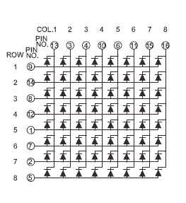
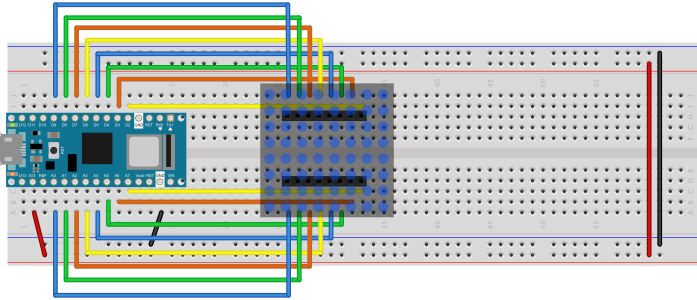

# 8x8 LED Matrix Displays

8x8 LED matrixes are made up of 64 LEDs in a single package, with their anodes and cathodes arranged in a matrix for row-column scanning. An 8x8 matrix requires 16 digital pins from a microcontroller to operate it. Many LED manufacturers make this common display. 


_Figure 1. 8x8 LED Display. Image from Digikey.com_

The circuit for these displays is shown in Figure 2. There are 8 supply pins, each connected to the anodes of 8 LEDs. There are also 8 ground pins, each connected to the cathodes of 8 LEDS. The LEDs are arranged in a grid, so that one LED from each supply line is attached to each of the ground lines. The pin numbers for the rows and columns will vary depending on the model and manufacturer, so see the data sheet of your particular display to get the right pin numbers.



_Figure 2. Schematic of an 8x8 LED Display._



_Figure 3. Breadboard view of an 8x8 LED matrix connected to an Arduino Nano 33 IoT. The rows are connected to pins D2 through D9. The columns are connected to pins A0 through A7._

When you connect a given supply line to voltage, and a given ground line to ground, then the LED corresponding to those two pins will light up. To control all the LEDs, you scan over the rows and columns like so:

````
Store the intended states of the LEDs in an array 

loop:
  loop over the columns  
    take this column high
    take all the rows high 
      loop over the rows
        Read the LED’s state from the array
        If this LED should be on,  
          Take this row low 
      End row loop
    Take this column low 
  End column loop
end loop
````
quoted from _[Physical Computing](https://dl.acm.org/doi/10.5555/1406766_)_, p. 397

This algorithm translates directly to code, as seen in the Arduino example below:

````arduino
// set the row and column pin numbers:
int col[] = {6, A2, A3, 3, A5, 4, 8, 9};
int row[] = {2, 7, A7, 5, A0, A6, A1, A4};

void setup() {
  // initialize all the pins as outputs:
  for (int i = 0; i < 8; i++) {
    pinMode(row[i], OUTPUT);
    pinMode(col[i], OUTPUT);
    // set the column pins HIGH:
    digitalWrite(col[i], HIGH);
  }
}

void loop() {
  // take the rows high:
  for (int r = 0; r < 8; r++) {
    digitalWrite(row[r], HIGH);
    // Take each column low to turn on (row, column):
    for (int c = 0; c < 8; c++) {
      digitalWrite(col[c], LOW);
      delay(100);
      // take the col high to turn off the LED:
      digitalWrite(col[c], HIGH);
    }
    // take the row low to turn off the whole row:
    digitalWrite(row[r], LOW);
  }
}
````

This repository contains several examples:
* [8x8LedMatrix](https://github.com/tigoe/display-examples/blob/main/LED_8x8_Matrix_examples/8x8LEDMatrix/) - simple test of a matrix, same code as shown above
* [8x8LEDMatrixJoystick](https://github.com/tigoe/display-examples/blob/main/LED_8x8_Matrix_examples/8x8LEDMatrixJoystick) - turns on a pixel with the move of a joystick
* [8x8LEDMatrixPixels](https://github.com/tigoe/display-examples/blob/main/LED_8x8_Matrix_examples/8x8LEDMatrixPixels) - calculates the pixel position from a one-dimensional array
* [LED_Matrices_0001](https://github.com/tigoe/display-examples/blob/main/LED_8x8_Matrix_examples/LED_Matrices_0001) - controls all the LEDs on two 8x8 LED matrices on an Arduino Mega, one at a time
* [LED_Matrices_pong_0002](https://github.com/tigoe/display-examples/blob/main/LED_8x8_Matrix_examples/LED_Matrices_pong_0002) - Plays pong on 2 8x8 LEDs with two potentiometers. For more on this, see [this blog post](https://www.tigoe.com/pcomp/code/arduinowiring/424/) and [this post](https://www.tigoe.com/pcomp/code/Processing/454/). 


