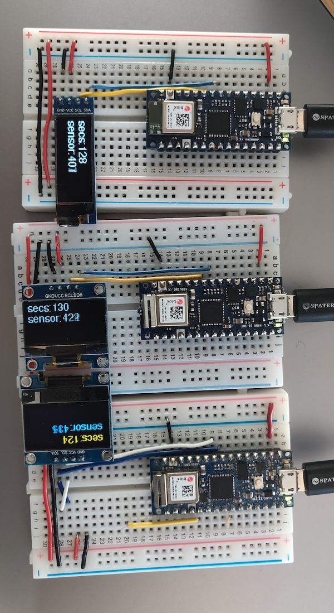

# OLED Displays

The OLED displays mentioned here are momochrome displays. They have a fairly good pixel-per-inch ratio, making them more visually rich than older passive-matrix LCDs, and they have a fast refresh rate, making them more useful than ePaper for dynamic displays. They're generally cheaper than TFT screens and use less energy. They're good when you need a simple text or monochrome graphic display. 

You can find the [code examples at this link](https://github.com/tigoe/display-examples/tree/main/OLED_Examples).

## Hardware 
All of the OLED displays I have used as of this writing use the [Solomon Systech](https://www.solomon-systech.com/) SSD13xx family of drivers. 

### Pin Connections
OLED displays can have either SPI or I2C interfaces, similar to other types of displays. Most of the ones tested here tend to use I2C interfaces, however. 

### SSD1306
The Solomon Systech SSD1306 OLED driver IC is a popular and inexpensive display driver in lots of display breakouts. You can find them on most of the popular electronics sites: [Adafruit](https://www.adafruit.com/product/661), [Sparkfun](https://www.sparkfun.com/products/17153) (including their [MicroOLED breakout](https://www.sparkfun.com/products/13003)), [DFRobot](https://www.dfrobot.com/product-1576.html), [Crystalfontz](https://www.crystalfontz.com/search.php?q=ssd1306&submit=Search), [MakerFocus](https://www.makerfocus.com/collections/oled), [Amazon](https://smile.amazon.com/s?k=ssd1306+oled+display), and many others. The displays are small, inexpensive and easy to use, and useful for simple displays. There are a number of variants from Solomon Systech, which you'll encounter in various vendors' products.

There are a number of 128x64 pixel models on the market that have one line of yellow pixels and the rest blue. You can't change the color of the pixels, so this can be annoying if you're looking for a single monochrome display. For example, a QR code in yellow and blue is not readable on most mobile devices. Figures 1 and 2 show the difference.

_Figure 1. Three SSD1306 OLED displays side by side. Left to right: 128x32, 128,64 monochrome, 128x64 blue and yellow._

_Figure 2. Three SSD1306 OLED displays side by side showing QR codes. Left to right: 128x32, 128,64 monochrome, 128x64 blue and yellow. All three displays contain the same QR code message, but the one in blue and yellow is not camera-readable. None are camera-readable from this photo because of the degradation of the image._

### Sparkfun Micro OLED Display
Sparkfun's [Micro OLED](https://www.sparkfun.com/products/13003) is a tiny display, just 64x48 pixels. It's based on the SSD1306, but doesn't work with the Adafruit libraries or the u8g2 library. The [Micro OLED Breakout Hookup Guide](https://learn.sparkfun.com/tutorials/micro-oled-breakout-hookup-guide) is useful if you are using this board. 

This board exposes both the SPI and I2C pins, so you can use either interface. However, unlike the other SSD1306 pins, you will need to add a pin for the reset and D/C connection on the board, whether you use SPI or I2C interface.

The Micro OLED board only works with their [Micro OLED library](https://github.com/sparkfun/SparkFun_Micro_OLED_Arduino_Library/tree/V_1.0.0). Their library takes a slightly different approach to layout than the Adafruit_GFX library, but it is possible to adapt from one to the other. The examples listed here connect to the microOLED via I2C as well as the reset and D/C pins of the breakout board. FIgure 3 shows the board connected to a Nano 33 IoT.

_Figure 3. MicroOLED display attached to a Nano 33 IoT._

### Crystalfontz Displays
Crystalfontz makes a number of displays, and I've just started to work with a few of them. These notes are very preliminary. 
* [128x128 Round OLED display](https://www.crystalfontz.com/product/cfal128128b0011w-128x128-round-oled-display) - uses SSD1327 driver
* [128x56 Transparent OLED Display](https://www.crystalfontz.com/product/cfal12856a00151b-128x56-transparent-oled-screen) - uses  SSD1309 driver. Works with u8g2 library and OLED breakout board below. 
* [OLED Breakout Board](https://www.crystalfontz.com/product/cfa10105-oled-breakout-board). Works with some of Crystalfontz' displays, but not the round ones. 

The Crystalfontz boards tend to default to the SPI interface. See the [SPI connections](../readme.md#spi-connections) section of the main page of this repository for a list of typical pin connections. 

#### SSD1309 Transparent OLED Display
The SSD1309 transparent OLED Display and breakout board  from Crystalfontz is a 128x56 display that you can see through. It works with the u8g2 library and the Crystalfontz OLED Breakout Board. It uses an SSD1309 driver, the same as Sparkfun's Transparent Graphical OLED Breakout board. I have not tested the Sparkfun board with the u8g2 library, nor this board with the Sparkfun Hyperdisplay library yet, however. There is an [example for this display](https://github.com/tigoe/display-examples/tree/main/OLED_Examples/u8g2_SSD1309_OLED_Example) using the SPI interface in this repository.  

## Libraries
Despite having the same driver, not all of these displays interoprate with all libraries. [Adafruit's SSD1306 library](https://github.com/adafruit/Adafruit_SSD1306) works well with all the 128x64 and 128x32 displays that I've tried, but not with ones that have other resolutions, like the Sparkfun Micro OLED, which has a 64x48 resolution. 

The [u8g2 library](https://github.com/olikraus/u8g2/wiki) by Oli Kraus, is intended as a universal monochrome display library for OLED, eInk, TFT, and other displays. It supports some SSD130x boards, but not all. 

